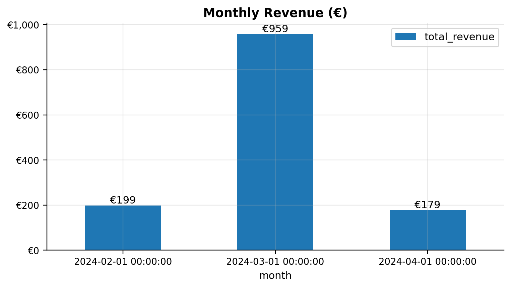
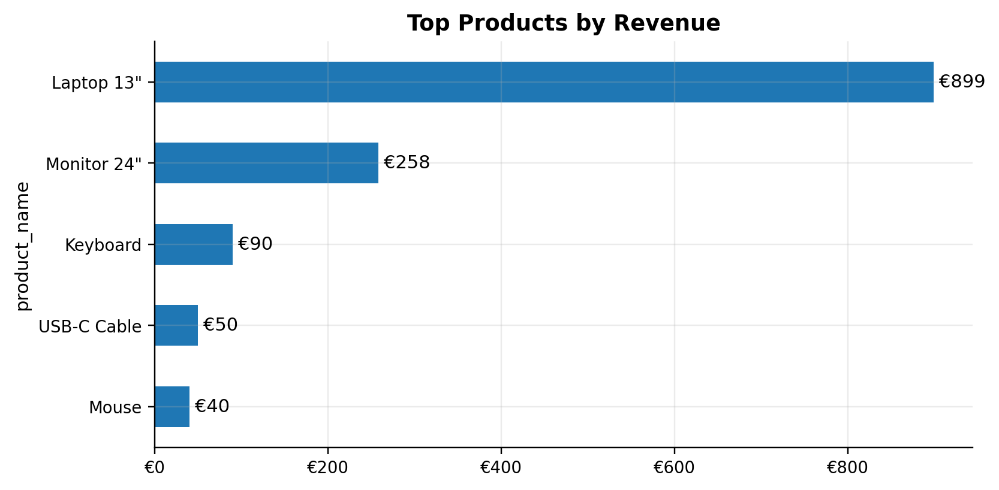
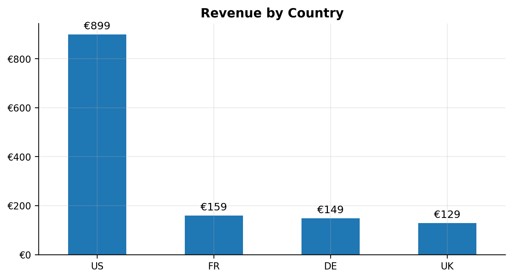
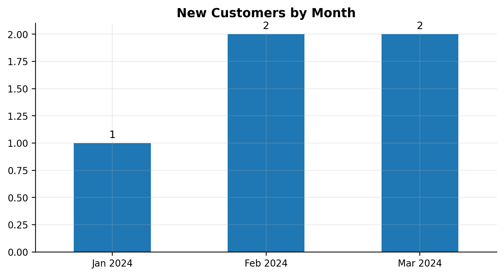
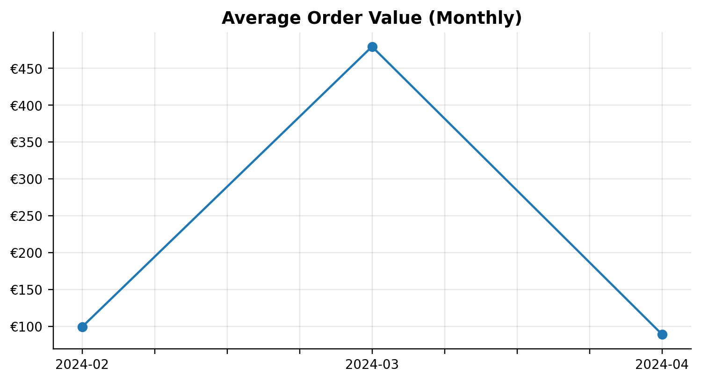

# Retail Analytics — SQL + Python

Hands-on analytics project to showcase what I learned in IBM’s **Databases and SQL for Data Science**: relational modeling, `JOIN` / `GROUP BY`, subqueries & CTEs, a first taste of window functions, and a clean **Python ↔ SQL** workflow with reproducible outputs (CSVs + charts).

## What I learned
- Translate business questions into SQL queries (KPIs, cohorts, top-N, AOV).
- Write `JOIN`, `GROUP BY`, `HAVING`, subqueries and CTEs; intro to window functions.
- Connect Python to a SQL database (SQLite), read queries with pandas, and export results.
- Produce clean charts with Matplotlib, save artefacts, and document the project for recruiters.
- Use Git/GitHub to version a small but complete data project.

## What’s inside
- **Relational schema** + **seed data** (`sql/01_schema.sql`, `sql/02_seed.sql`)
- **KPI queries** in SQL (`sql/03_kpi_queries.sql`)
- **Jupyter notebook** to run queries and generate **CSVs** + **PNG charts**
- Minimal, reproducible **project structure**

```
retail-analytics-sql-python/
├─ data/
│  ├─ raw/                # (placeholder)
│  └─ processed/          # CSV outputs created by the notebook
├─ dashboards/            # PNG charts saved by the notebook
├─ notebooks/
│  └─ analysis.ipynb      # main notebook
├─ sql/
│  ├─ 01_schema.sql
│  ├─ 02_seed.sql
│  └─ 03_kpi_queries.sql
├─ src/
│  ├─ db_connect.py
│  └─ setup_db.py         # (re)creates + seeds the SQLite DB
├─ requirements.txt
└─ retail.db              # local SQLite DB (ignored by .gitignore)
```
## Data model (ERD)

```mermaid
erDiagram
  CUSTOMERS {
    INT customer_id PK
    DATE signup_date
    TEXT country
  }
  PRODUCTS {
    INT product_id PK
    TEXT product_name
    TEXT category
    REAL unit_price
  }
  ORDERS {
    INT order_id PK
    INT customer_id FK
    DATE order_date
  }
  ORDER_ITEMS {
    INT order_item_id PK
    INT order_id FK
    INT product_id FK
    INT quantity
    REAL unit_price
  }
  CUSTOMERS ||--o{ ORDERS : places
  ORDERS ||--|{ ORDER_ITEMS : contains
  PRODUCTS ||--o{ ORDER_ITEMS : includes
```md

## KPIs implemented
1. **Monthly Revenue**  
2. **Top Products by Revenue**  
3. **Revenue by Country**  
4. **New Customers by Month**  
5. **Average Order Value (AOV) by Month**  
6. *(Bonus in notebook)* **New vs Repeat orders by Month** (stacked bars)

## Visuals
> All charts are saved under `/dashboards` and render in this README.







## Results (Executive Summary)
- **Total revenue (period):** €1 336
- **Max MoM:** +383% in Mar 2024
- **Top products:** Laptop 13", Monitor 24", Keyboard
- **Top country:** US
- **Average Order Value:** €223

## How to run (Windows / PowerShell)
```powershell
# 1) Create & activate a virtual environment
py -m venv .venv
.\.venv\Scripts\Activate.ps1

# 2) Install dependencies
py -m pip install -r requirements.txt

# 3) (Re)create and seed the SQLite database
py src\setup_db.py

# 4) Open the notebook
py -m jupyter notebook notebooksnalysis.ipynb
```
> If PowerShell blocks script execution once:  
> `Set-ExecutionPolicy -ExecutionPolicy RemoteSigned -Scope CurrentUser`

## How it works
- The notebook loads the SQL text from `sql/03_kpi_queries.sql`, runs each KPI query with `pandas.read_sql_query`, and writes results into `/data/processed` (CSV).
- Each plot is saved as a PNG into `/dashboards` for easy preview on GitHub.
- The database can be rebuilt at any time with `src/setup_db.py`.

## Next steps (roadmap)
- Add a small **Insights** section with 3–4 quantified bullets.
- Try a simple **window function** (e.g., running totals) if you move to Postgres/BigQuery.
- Create a companion **BI dashboard** (Power BI or Tableau) and link a screenshot.
- Next course: **Python for Data Science (IBM)** → new repo `python-eda-portfolio`.

## License
MIT — see `LICENSE`.

### Author
Built by **Dylan BL** — aiming for data roles (Analytics / BI / Data Engineering).
